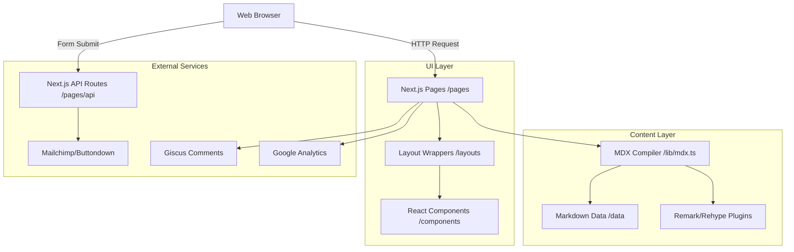

# CODEBASE MASTER: Portfolio Website

## Table of Contents

1. [Tech Stack Analysis](#1-tech-stack-analysis)
2. [Application Architecture](#2-application-architecture)
3. [File & Module Breakdown](#3-file--module-breakdown)
4. [Data & Control Flow](#4-data--control-flow)
5. [APIs & Public Interfaces](#5-apis--public-interfaces)
6. [Dependency Map](#6-dependency-map)
7. [Complete Regeneration Guide](#7-complete-regeneration-guide)
8. [Environment & Configuration](#8-environment--configuration)
9. [Testing & Quality Strategy](#9-testing--quality-strategy)
10. [Quick Reference](#10-quick-reference)

---

## 1. Tech Stack Analysis

This application is a statically generated React application powered by Next.js, using MDX for content management. It is heavily tailored for a developer portfolio and blog.

| Layer           | Technology             | Version         | Purpose                                                                         | Key Files                                |
| --------------- | ---------------------- | --------------- | ------------------------------------------------------------------------------- | ---------------------------------------- |
| **Framework**   | Next.js                | 12.1.5          | Core SSR/SSG React framework, routing, and API endpoints.                       | `package.json`, `next.config.js`         |
| **UI Library**  | React / Preact         | 17.0.2 / 10.6.2 | UI rendering. _Note: Preact is aliased in production for smaller bundle sizes._ | `next.config.js`, `package.json`         |
| **Styling**     | Tailwind CSS           | 3.0.18          | Utility-first CSS styling, typography, and dark mode support.                   | `tailwind.config.js`, `css/tailwind.css` |
| **Content**     | MDX (`mdx-bundler`)    | 8.0.0           | Compiles Markdown with embedded React components.                               | `lib/mdx.ts`, `data/**/*.mdx`            |
| **Language**    | TypeScript             | 4.6.1           | Static typing for robust component and API logic.                               | `tsconfig.json`, `**/*.ts`, `**/*.tsx`   |
| **Comments**    | Giscus / Utterances    | N/A             | Client-side comment system loading via GitHub discussions/issues.               | `components/comments/`                   |
| **Newsletters** | Buttondown / Mailchimp | N/A             | Email list subscriptions through API routes.                                    | `pages/api/*.ts`                         |
| **Build Tools** | Webpack / esbuild      | N/A             | Bundling and transforming assets under the Next.js hood.                        | `next.config.js`                         |

---

## 2. Application Architecture

- **Application Type**: Monolith Static Site Generation (SSG) / Single Page Application (SPA).
- **Architectural Pattern**: Component-Based Architecture with Markdown-as-a-CMS and Serverless API routes.
- **Entry Points**:
  - User Interface: `pages/_app.tsx` and `pages/index.tsx`.
  - API endpoints: `pages/api/*.ts`.
  - Content Compilation: `lib/mdx.ts`.

### System Diagram

### Request/Response Lifecycle

1. **Build Time (SSG)**: Next.js triggers `getStaticProps` on routes. `lib/mdx.ts` reads the `.mdx` files in `/data`, parses frontmatter using `gray-matter`, bundles the markdown using `mdx-bundler`, and injects the bundled code into the page templates.
2. **Client Load**: The browser loads the static HTML. React hydrates the page.
3. **User Interaction**: Users navigate routes instantly via Next.js `<Link>`.
4. **API Interaction**: When a user subscribes to the newsletter, a POST request is sent to `/api/[provider]`, which communicates with external APIs and returns a success response.

---

## 3. File & Module Breakdown

### `pages/` (Routing & Entry Points)

- **`_app.tsx` / `_document.tsx`**: Next.js custom app and document wrappers (injects analytics, CSS, fonts). _Complexity: Medium._
- **`index.tsx`**: The homepage, fetching the latest blog posts and displaying the author introduction. _Complexity: Medium._
- **`blog.tsx` / `courses.tsx`**: List views for paginated content. _Complexity: Low._
- **`blog/[...slug].tsx`**: Dynamic route generating individual blog posts. _Complexity: High. Responsibilities: Maps URLs to file system MDX files, fetches bundled code, handles prev/next post linking._

### `lib/` (Core Logic)

- **`mdx.ts`**: The engine of the CMS. Reads files, extracts frontmatter, and runs `mdx-bundler` with all `remark`/`rehype` plugins (math, syntax highlighting, image optimization). _Complexity: High._
- **`generate-rss.ts`**: Script to generate XML RSS feeds at build time. _Complexity: Medium._
- **`tags.ts`**: Aggregates all tags used across MDX files to generate tag clouds and filter pages. _Complexity: Medium._

### `layouts/` (Page Wrappers)

- **`PostLayout.tsx`**: The main layout for blog posts. Includes the author details, comments section, and "Next/Prev" post navigation. _Complexity: High._
- **`AuthorLayout.tsx`**: Layout for the "About" page. _Complexity: Low._
- **`ListLayout.tsx`**: Layout used for displaying a search bar and a list of posts. _Complexity: Medium._

### `components/` (UI Elements)

- **`MDXComponents.tsx`**: A mapping of standard Markdown HTML elements to custom React components (e.g., overriding `<a>` with `next/link`).
- **`SEO.tsx`**: Injects meta tags, OpenGraph data, and Twitter cards into the `<head>`.
- **`comments/`**: Contains providers (`Giscus.tsx`, `Utterances.tsx`, `Disqus.tsx`) dynamically loaded based on `siteMetadata` config.

### `data/` (The Database)

- **`blog/` & `courses/` & `authors/`**: Directories containing `.mdx` files.
- **`siteMetadata.js`**: Central configuration for the whole website (title, social links, provider toggles).

---

## 4. Data & Control Flow

### Data Models (Frontmatter Schema)

All content is strictly modeled via YAML frontmatter at the top of `.mdx` files:

- **Blog Post**:
  - `title`: string
  - `date`: string (ISO 8601)
  - `tags`: string[]
  - `draft`: boolean (prevents publishing)
  - `summary`: string
  - `images`: string[] (for OpenGraph)
  - `layout`: string (maps to components in `/layouts`)

### State Management

- **Global State**: Theme mode (Light/Dark) is managed by `next-themes` injected in `_app.tsx`.
- **Local State**: Used in search inputs (`ListLayout.tsx`) and newsletter forms (`NewsletterForm.tsx`).

### Error Handling Strategy

- **Client Side**: Try/catch blocks in API fetch requests (newsletter).
- **Server/Build Side**: Next.js build errors if an MDX file contains invalid syntax.

### Critical Path: Rendering a Blog Post

1. Next.js router matches `/blog/my-post`.
2. `getStaticProps` in `pages/blog/[...slug].tsx` is called.
3. `getFileBySlug('blog', 'my-post')` is executed from `lib/mdx.ts`.
4. MDX is parsed into executable React code.
5. The `PostLayout.tsx` wraps the executed React code.
6. The HTML is statically generated and sent to the browser.

---

## 5. APIs & Public Interfaces

### HTTP Endpoints (Serverless Functions)

| Method | Path              | Auth | Request Body        | Response      | Description                         |
| ------ | ----------------- | ---- | ------------------- | ------------- | ----------------------------------- |
| POST   | `/api/buttondown` | None | `{ email: string }` | `201 Created` | Subscribes email via Buttondown API |
| POST   | `/api/convertkit` | None | `{ email: string }` | `201 Created` | Subscribes email via ConvertKit API |
| POST   | `/api/klaviyo`    | None | `{ email: string }` | `201 Created` | Subscribes email via Klaviyo API    |
| POST   | `/api/mailchimp`  | None | `{ email: string }` | `201 Created` | Subscribes email via Mailchimp API  |

_Note: The website dynamically uses only ONE of these endpoints based on `siteMetadata.newsletter.provider`._

---

## 6. Dependency Map

### Core Direct Dependencies

- **`next` (12.1.5) & `react` (17.0.2)**: Core framework.
- **`tailwindcss` (3.0.18)**: Core styling.
- **`mdx-bundler` (8.0.0)**: Compiles MDX strings to React components.
- **`gray-matter`**: Parses YAML frontmatter from markdown files.
- **`rehype-*` & `remark-*`**: A suite of AST transformers for markdown.
  - `rehype-prism-plus`: Syntax highlighting.
  - `rehype-katex` / `remark-math`: Math equation rendering.
  - `remark-gfm`: GitHub flavored markdown (tables, task lists).

### Build & Tooling Dependencies

- **`eslint` & `prettier`**: Code formatting.
- **`husky` & `lint-staged`**: Git hooks to ensure code quality before commits.

### Optimizations

- **Preact Substitution**: `next.config.js` forcibly aliases `react` to `preact/compat` in the production client build. This radically drops the JavaScript bundle size.
- **Bundle Analyzer**: Controlled via `ANALYZE=true npm run build` to output bundle sizes.

---

## 7. Complete Regeneration Guide

_Instructions for an AI or Developer to rebuild this repository from scratch._

### 7a. Application Blueprint Summary

This is a high-performance developer portfolio and blog. It generates static HTML files from Markdown (MDX) source files. It features dark mode, syntax highlighting, math equation support, SEO optimization, and newsletter integrations.

### 7b. Rebuild Sequence

1. **Initialize Next.js**: Create a Next.js project with TypeScript.
2. **Configure Tailwind**: Setup Tailwind CSS with typography and forms plugins.
3. **Create CMS Core**: Write `lib/mdx.ts` to read local markdown files using `fs` and compile them using `mdx-bundler`.
4. **Build the UI Shell**: Create `components/LayoutWrapper.tsx`, `components/Header.tsx`, and `components/Footer.tsx`.
5. **Implement Layouts**: Create layout templates for lists (`ListLayout.tsx`) and single items (`PostLayout.tsx`).
6. **Construct Pages**: Connect `pages/index.tsx`, `pages/blog/[...slug].tsx` to the `lib/mdx.ts` fetching logic.
7. **Add Features**: Inject the comments components and the API routes for newsletters.

### 7c. File Generation Manifest

- **`next.config.js`**: Must configure security headers, alias react to preact, and add webpack rules for SVG/files.
- **`tailwind.config.js`**: Must define a custom `typography` theme mapped to dark mode colors.
- **`data/siteMetadata.js`**: Must be created to act as the single source of truth for global variables.
- **`pages/_app.tsx`**: Must wrap the component tree with `<ThemeProvider>` (from `next-themes`) and `<LayoutWrapper>`.
- **`pages/_document.tsx`**: Must configure fonts and custom `<body>` background colors for dark mode.

### 7d. Business Logic Specification

- **MDX Bundling**: Read the file system synchronously. Extract frontmatter. Pass the raw string to `mdx-bundler`. Attach remark plugins to generate Table of Contents, math nodes, and syntax highlighting. Return `{ mdxSource, frontMatter }`.
- **Tag Generation**: Scan all markdown files, extract `tags` arrays, normalize to lowercase, and maintain a frequency count dictionary. Output as a JSON object to generate the Tags page.

### 7e. Integration Points

- **Comments**: Implement dynamic loading. For Giscus, append a `<script>` tag to a specific `div` ref mapping data attributes to environment variables (`NEXT_PUBLIC_GISCUS_REPO`, etc.).
- **Newsletters**: Create an async POST handler. Read the provider API Key from `process.env`. Send a formatted fetch request to the provider's REST API. Return generic 201 or 500 status to the client.

### 7f. Invariants & Constraints

- Markdown files must contain valid YAML frontmatter.
- Static generation requires all Markdown files to be available at build time.
- Next.js version is pinned to 12.x; updating to 13/14 requires rewriting the `pages/` directory to the `app/` directory paradigm.

---

## 8. Environment & Configuration

### Config Files

- **`next.config.js`**: Configures Content Security Policy (CSP), webpack loaders, and Preact aliasing.
- **`tailwind.config.js`**: Controls styling tokens.
- **`data/siteMetadata.js`**: Controls application behavior (which comment system to use, author name, social links).

### Environment Variables

_(Usually stored in `.env.local` or `.env.production`)_

| Variable                           | Required | Purpose                                             |
| ---------------------------------- | -------- | --------------------------------------------------- |
| `NEXT_PUBLIC_GISCUS_REPO`          | Optional | GitHub Repo for Giscus comments (e.g., `user/repo`) |
| `NEXT_PUBLIC_GISCUS_REPOSITORY_ID` | Optional | Internal GraphQL ID for the GitHub Repo             |
| `NEXT_PUBLIC_GOOGLE_ANALYTICS_ID`  | Optional | GA Tracking ID                                      |
| `MAILCHIMP_API_KEY`                | Optional | Secret key for Mailchimp API routing                |
| `MAILCHIMP_AUDIENCE_ID`            | Optional | Audience List ID for Mailchimp                      |
| `BUTTONDOWN_API_KEY`               | Optional | Secret key for Buttondown API routing               |

_Note: Variables prefixed with `NEXT_PUBLIC_`are injected directly into the client bundle at build time. Others remain secure on the server (used only in`/api/` routes).\_

---

## 9. Testing & Quality Strategy

- **Testing Landscape**: Currently, there is **no automated testing framework** (Jest/Cypress) implemented. The architecture relies on strict typing and build-time generation checks.
- **Type Checking**: TypeScript (`tsc --noEmit`) validates the props, API contracts, and internal logic.
- **Linting & Formatting**:
  - `eslint-config-next` handles React/Next.js best practices.
  - `prettier` enforces formatting.
  - `husky` and `lint-staged` run these checks automatically on `git commit`.
- **Risks & Gaps**:
  - Missing unit tests for the complex MDX parsing logic in `lib/mdx.ts`.
  - Missing integration tests for the Newsletter API routes.
  - Changes to Markdown files can break the build if frontmatter formatting is malformed, acting as an implicit build-time test but resulting in poor developer experience if untracked.

---

## 10. Quick Reference

- **Directory**: `d:\Dev\Projects\portfolio`
- **To Start Development**: `npm run dev`
- **To Build**: `npm run build` (This generates static files into `.next/`)
- **To Add Content**: Create a new `.mdx` file in `data/blog/`.
- **To Change Theme Options**: Edit `tailwind.config.js` and `data/siteMetadata.js`.
- **Key Caveat**: Next.js replaces React with Preact in production builds. If you encounter strange production-only React bugs, temporarily disable Preact in `next.config.js` to debug.
